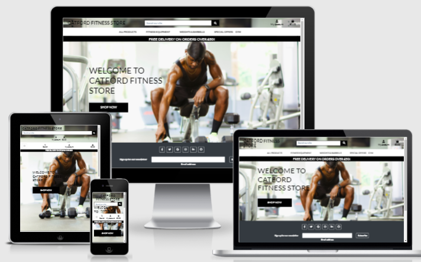

# Catford Fitness Store

## Milestone Project 4

- This project aims to build a full-stack web application using Django full-stack web framework, HTML, CSS3 and Javascript.

  - I have built an e-commerce web application for a fitness store that sells fitness equipment to individuals/companies and in the process of adding a gym of their own that will be ran on membership subscription basis.
  
  - My application features e-commerce functionality, payments using stripe, a blog section, user login, confirmation emails, CRUD functionality for admin to add blog posts and stock items, and an admin section, for the admin user to access database records.

  - For the assessor, I have included the admin login details in the comments section when submitting the project.

  - This website is for educational purposes and the stripe functionality is set up to accept the test card details please don't enter your personal card details. 
  
     - To use the stripe function use the following details.

        - card number : 4242 4242 4242 4242
        - Any future date
        - Any five figures.

## Live project

- [View the live project here.](https://oakerele-catford-fitness.herokuapp.com)

## Table of Contents.

- [User experience](#user-experience)
  * [User Stories](#user-stories)
  * [WireFrames](#wireframes)
  * [Database models and schema](#database-models-and-schema)
    + [Models](#models)
  * [Design](#design)
    + [Colour scheme](#colour-scheme)
    + [Typography](#typography)
    + [Images](#images)
    + [Icons](#icons)
- [Features](#features)
    + [Homepage App.](#homepage-app)
    + [Stock App](#stock-app)
    + [Cart App.](#cart-app)
    + [Checkout app.](#checkout-app)
    + [Reviews app.](#reviews-app)
    + [Users app.](#users-app)
    + [Wishlist app.](#wishlist-app)
    + [Blog app.](#blog-app)
- [Testing](#testing)
    + [Testing.](#testing)
- [Technologies used.](#technologies-used)
  * [Languages Used.](#languages-used)
  * [Django, and Django extensions used](#django--and-django-extensions-used)
  * [Frameworks Libraries and Programs.](#frameworks-libraries-and-programs)
  * [Deployment.](#deployment)
    + [Github, Gitpod, Git, Heroku, and Amazon AWS.](#github--gitpod--git--heroku--and-amazon-aws)
    + [Project setup.](#project-setup)
    + [Deployment to Heroku](#deployment-to-heroku)
    + [Amazon AWS](#amazon-aws)
    + [Setting up locally](#setting-up-locally)
- [Credits.](#credits)
  * [Code.](#code)
    + [Kevin Powell Youtube video.](#kevin-powell-youtube-video)
    + [The WebShala Thumbnail slider](#the-webshala-thumbnail-slider)
    + [Stack Overflow](#stack-overflow)
  * [Content](#content)
  * [Media](#media)
  * [Acknowledgements](#acknowledgements)

## User experience

### User Stories

- Customers
  - Website experience
    - As a customer, I would like to see what the website is selling.
    - As a customer, I would like to be able to navigate the website easily.
    - As a customer, I would like to see some information about the company.
    - As a customer, I would like to be able to contact the company.
  
  - Searching for items.
    - As a customer, I would like to see all the products the company sells.
    - As a customer, I would like to be able to search by category.
    - As a customer, I would like to be able to search through the items.
    - As a customer, I would like to sort the items by price.

  - Shopping.
    - As a customer, I would like to see the product price and description.
    - As a customer, I would like to be able to add products to my shopping cart.
    - As a customer, I would like to be notified when I complete interactions with the site.
    - As a customer, I would like to be able to edit my shopping cart.
    - As a customer, I would like to be able to checkout easily.
    - As a customer, I would like to receive confirmation of my order.

  - Account.
    - As a customer, I would like to save my details to an account.
    - As a customer, I would like to see my previous order details.
    - As a customer, I would like to leave a review of the company.

- Website owner.
  - As the business owner, I would like to be able to edit and add products easily.
  - As the business owner, I would like to be able to delete products.
  - As the business owner, I would like to have access to an admin section. 
  - As the business owner, I would like my customers to be able to shop on the site easily.