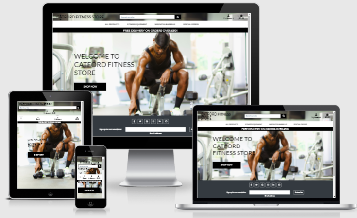
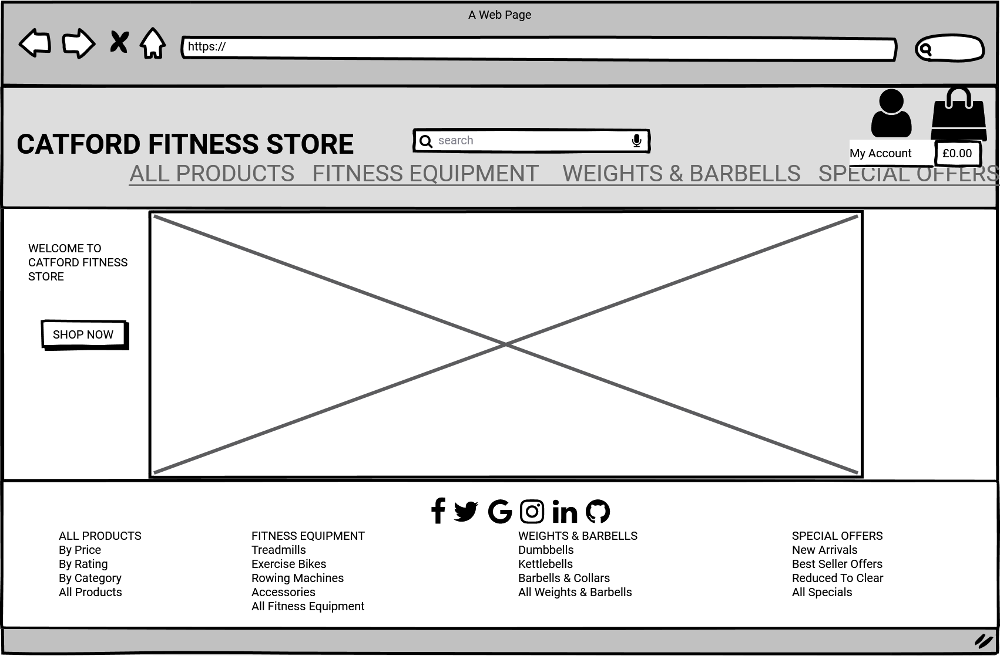

# Catford Fitness Store

## Milestone Project 4

- This project aims to build a full-stack web application using Django full-stack web framework, HTML, CSS3 and Javascript.

  - I have built an e-commerce web application for a fitness store that sells fitness equipment to individuals/companies.
  
  - My application features e-commerce functionality, payments using stripe, user login, confirmation emails, CRUD functionality for admin to add stock items, and an admin section, for the admin user to access database records.

  - For the assessor, I have included the admin login details in the comments section when submitting the project.

  - This website is for educational purposes and the stripe functionality is set up to accept the test card details please don't enter your personal card details. 
  
     - To use the stripe function use the following details.

        - card number : 4242 4242 4242 4242
        - Any future date
        - Any five figures.

## Live project

- [View the live project here.](https://oakerele-catford-fitness.herokuapp.com)

## Table of Contents.

1. [User Experience](#user-Experience)
    - [Project Goal](#project-goal)
    - [User Stories](#user-stories)
    - [Developer Goal](developer-goal)
    - [Design Choices](#design-choices)
2. [Wireframes And Mockups](#wireframes-and-mockups)
3. [Features](#features)
    + [Homepage App.](#homepage-app)
    + [Products App](#products-app)
    + [Bag App.](#bag-app)
    + [Checkout app.](#checkout-app)
    + [Profiles app.](#profiles-app)
- [Testing](#testing)
    + [Testing.](#testing)
- [Technologies used.](#technologies-used)
  * [Languages Used.](#languages-used)
  * [Django, and Django extensions used](#django--and-django-extensions-used)
  * [Frameworks Libraries and Programs.](#frameworks-libraries-and-programs)
  * [Deployment.](#deployment)
    + [Github, Gitpod, Git, Heroku, and Amazon AWS.](#github--gitpod--git--heroku--and-amazon-aws)
    + [Project setup.](#project-setup)
    + [Deployment to Heroku](#deployment-to-heroku)
    + [Amazon AWS](#amazon-aws)
    + [Setting up locally](#setting-up-locally)
- [Credits.](#credits)
  * [Code.](#code)
    + [Kevin Powell Youtube video.](#kevin-powell-youtube-video)
    + [The WebShala Thumbnail slider](#the-webshala-thumbnail-slider)
    + [Stack Overflow](#stack-overflow)
  * [Content](#content)
  * [Media](#media)
  * [Acknowledgements](#acknowledgements)

## User experience

### Project Goal
The main goal of this project is to implement some ***e-commerce store*** where customers can log in online,  
search for products of interest to them, select them and be able to securely check out and make payment online  
for the products purchased.

### User Stories

- Customers
  - Website experience
    - As a customer, I would like to see what the website is selling.
    - As a customer, I would like to be able to navigate the website easily.
    - As a customer, I would like to see some information about the company.
    - As a customer, I would like to be able to contact the company.
  
  - Searching for items.
    - As a customer, I would like to see all the products the company sells.
    - As a customer, I would like to be able to search by category.
    - As a customer, I would like to sort the items by price.
    - As a customer, I would like to sort the items by rating.

  - Shopping.
    - As a customer, I would like to see the product price and description.
    - As a customer, I would like to be able to add products to my shopping cart.
    - As a customer, I would like to be notified when I complete interactions with the site.
    - As a customer, I would like to be able to edit my shopping cart.
    - As a customer, I would like to be able to checkout easily.
    - As a customer, I would like to receive confirmation of my order.

  - Account.
    - As a customer, I would like to save my details to an account.
    - As a customer, I would like to see my previous order details.
    - As a customer, I would like to leave a review of the company.

### Developer Goal

  - As the business owner, I would like to be able to edit and add products easily.
  - As the business owner, I would like to be able to delete products.
  - As the business owner, I would like to have access to an admin section. 
  - As the business owner, I would like my customers to be able to shop on the site easily.

## Design Choices
Bearing in mind the three main purposes of design i.e. communication, aesthetics and functionality,  
I choose to use black, grey and light grey with white background to build a beautiful and attractive  user interface. Blue for update, red for delete and warnings and black color for the buttons. 

# Wireframes And Mockups 
* Sketching
* Drawings
* Features
* Design with Balsamiq

- ### Wireframes & Sketches
    - 

        
Home

        
        
    

    - 

        
Home Mobile

        
        
    

    - 

        
Product Page

        
        
    

    - 

        
Product Management

        
        
    

    - 

        
Shopping Bag

        
        
    

    - 

        
Checkout

        
        
    

    - 

        
Sign Up

        
        
    

    - 

        
Sign In

        
        
    

    - 

        
My Profile

        
        
    

- ### Mockups
    - 

        
Home

        
    

    - 

        
All Products

        
    

    - 

        
Product

        
    

    - 

        
Product Management

        
    

    
    - 

        
Shopping Bag

        
    

    - 

        
Checkout

        
    

    - 

        
Sign Up

        
    

    - 

        
Sign In

        
    

    - 

        
My Profile

        
    

# Existing Features
There are 8 key pages on this website:
+ [Homepage App.](#homepage-app)
+ [Products App](#products-app)
+ [Bag App.](#bag-app)
+ [Checkout app.](#checkout-app)
+ [Profiles app.](#profiles-app)

Every page is designed to show the navbar displaying the name of this e-commerce store and the   categories of available products that are sold by the store. The mobile phone is designed to display   the pages in a collapsible manner because of the number of pages to be displayed, the minimum of which   is four and maximum of six and some pages have lengthy name. In the middle are the sections that display   the message/information for the page. While at the bottom is the footer which is designed to take users  direct to the products that are sold by the store. The navbar was designed with Bootstrap.

## Home Page

The Home page is an introductory page for the store. It contains the navbar and only four pages viz: 
* All Products - This has a drop down button that contains the ability for the users to be able to   sort: By Price; By Rating and By Category   
* Fitness Equipment - This is the category for all our fitness equipment with a drop down that shows   Treadmills, Exercise Bikes, Rowing Machines, Accessories and All Fitness Equipment (all the products   in that category). 
* Weights and Barbells - This category contains Dumbbells, Kettlebells, Barbells & Collars and All  
Weights & Barbells (all the products in that category). 
* Special Offers - This category contain promotions that will attract increase in sales as it sets out  New Arrivals, Best Seller Offers, Reduced to clear and All Specials (all the products in that category). 

## Product Page

 - Product Detail Page displays product image, title, description, quantity selector, price, 'put in the cart' button, and Reviews section at the bottom of the page.
    - When the user clicks +/- buttons for quantity, the quantity increases or decreases, and the price updates to reflect that.
    - the - button and + button are disabled (function and style) if the user has entered 1 or 10 to indicate that they cannot add more/less.
    - Typing has been disabled to prevent as much as possible for the user to 'accidentally' select more or less than the allowed quantity.
    - Arrow buttons are still available but allow the user to only enter 1-10 by using form validation.
    - If the user overrides the front-end validation (deleting HTML max and min attributes in Google Develop Tools for example) and enters a value that's >10 or <0, an error message is displayed and quantity not added.
    - When the user has selected a valid quantity and the 'Add to cart' button is clicked, an item is added to the cart and a cart notification is displayed with all items in the cart and the page is refreshed.
    - Reviews section shows all reviews (if any), the overall average product rating, and a Review button.
    - Review button is only displayed to logged-in users. This was tested by looking at pages while logged in and also when not.
    - When the Review button is clicked, a modal is opened as an overlay on the page with a review form. All fields are required and the form will not submit otherwise.
    - When 'x' or 'cancel' are clicked, the module is closed without saving.
    - When the form is filled out and the user clicks 'Add', the review is saved to the database, modal is closed and a success notification tells the user that the review was successfully added.
    - Overall rating is updated to include the new rating, and the review is displayed automatically.
    - User can only add 1 review per item
    - User can see 'edit' and 'delete' buttons under their reviews.
    - When the 'Edit' button is clicked, the modal opens with review's details prefilled. When 'x' and 'cancel' are clicked, the modal closes, and the review is not updated. If 'Edit' is clicked, the review is updated, modal closed, and a message is displayed to let the user know.
    - If the 'delete' button is clicked, a modal appears asking the user to confirm if they want to delete the review. If 'x' or cancel are clicked, the modal is closed and the review is not deleted. If 'delete' is clicked, the review is deleted and a message is displayed confirming it to the user.

