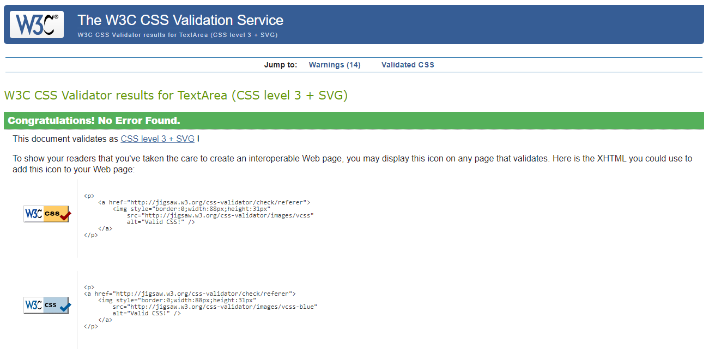

# Catford Fitness Store

## Milestone Project 4

- This project aims to build a full-stack web application using Django full-stack web framework, HTML, CSS3 and Javascript.

  - I have built an e-commerce web application for a fitness store that sells fitness equipment to individuals/companies.
  
  - My application features e-commerce functionality, payments using stripe, user login, confirmation emails, CRUD functionality for admin to add stock items, and an admin section, for the admin user to access database records.

  - For the assessor, I have included the admin login details in the comments section when submitting the project.

  - This website is for educational purposes and the stripe functionality is set up to accept the test card details please don't enter your personal card details. 
  
     - To use the stripe function use the following details.

        - card number : 4242 4242 4242 4242
        - Any future date
        - Any five figures.

## Live project

- [View the live project here.](https://oakerele-catford-fitness.herokuapp.com)

## Table of Contents.

1. [User Experience](#user-Experience)
    - [Project Goal](#project-goal)
    - [User Stories](#user-stories)
    - [Developer Goal](developer-goal)
    - [Design Choices](#design-choices)
2. [Wireframes And Mockups](#wireframes-and-mockups)
3. [Existing Features](#features)
    + [Homepage App.](#homepage-app)
    + [Products App](#products-app)
    + [Bag App.](#bag-app)
    + [Checkout app.](#checkout-app)
    + [Profiles app.](#profiles-app)
4. [Features To Implement](#features-to-implement)
5. [Technologies used.](#technologies-used)
  * [Languages Used.](#languages-used)
  * [Django, and Django extensions used](#django--and-django-extensions-used)
  * [Frameworks Libraries and Programs.](#frameworks-libraries-and-programs)
6. [Deployment.](#deployment)
    + [Github, Gitpod, Git, Heroku, and Amazon AWS.](#github--gitpod--git--heroku--and-amazon-aws)
    + [Project setup.](#project-setup)
    + [Deployment to Heroku](#deployment-to-heroku)
    + [Amazon AWS](#amazon-aws)
    + [Setting up locally](#setting-up-locally)
7. [Testing](#testing)
8. [Credits](#credits)
    - [Content](#content)
    - [Media](#media)
    - [Acknowledgments](#acknowledgments)

## User experience

### Project Goal
The main goal of this project is to implement some ***e-commerce store*** where customers can log in online,  
search for products of interest to them, select them and be able to securely check out and make payment online  
for the products purchased.

### User Stories

- Customers
  - Website experience
    - As a customer, I would like to see what the website is selling.
    - As a customer, I would like to be able to navigate the website easily.
    - As a customer, I would like to see some information about the company.
    - As a customer, I would like to be able to contact the company.
  
  - Searching for items.
    - As a customer, I would like to see all the products the company sells.
    - As a customer, I would like to be able to search by category.
    - As a customer, I would like to sort the items by price.
    - As a customer, I would like to sort the items by rating.

  - Shopping.
    - As a customer, I would like to see the product price and description.
    - As a customer, I would like to be able to add products to my shopping cart.
    - As a customer, I would like to be notified when I complete interactions with the site.
    - As a customer, I would like to be able to edit my shopping cart.
    - As a customer, I would like to be able to checkout easily.
    - As a customer, I would like to receive confirmation of my order.

  - Account.
    - As a customer, I would like to save my details to an account.
    - As a customer, I would like to see my previous order details.
    - As a customer, I would like to leave a review of the company.

### Developer Goal

  - As the business owner, I would like to be able to edit and add products easily.
  - As the business owner, I would like to be able to delete products.
  - As the business owner, I would like to have access to an admin section. 
  - As the business owner, I would like my customers to be able to shop on the site easily.

## Design Choices
Bearing in mind the three main purposes of design i.e. communication, aesthetics and functionality,  
I choose to use black, grey and light grey with white background to build a beautiful and attractive  user interface. Blue for update, red for delete and warnings and black color for the buttons. 

# Wireframes And Mockups 
* Sketching
* Drawings
* Features
* Design with Balsamiq

- ### Wireframes & Sketches
    - 

        
Home

        
        
    

    - 

        
Home Mobile

        
        
    

    - 

        
Product Page

        
        
    

    - 

        
Product Management

        
        
    

    - 

        
Shopping Bag

        
        
    

    - 

        
Checkout

        
        
    

    - 

        
Sign Up

        
        
    

    - 

        
Sign In

        
        
    

    - 

        
My Profile

        
        
    

- ### Mockups
    - 

        
Home

        
    

    - 

        
All Products

        
    

    - 

        
Product

        
    

    - 

        
Product Management

        
    

    
    - 

        
Shopping Bag

        
    

    - 

        
Checkout

        
    

    - 

        
Sign Up

        
    

    - 

        
Sign In

        
    

    - 

        
My Profile

        
    

# Existing Features
There are 8 key pages on this website:
+ [Homepage App.](#homepage-app)
+ [Products App](#products-app)
+ [Bag App.](#bag-app)
+ [Checkout app.](#checkout-app)
+ [Profiles app.](#profiles-app)

### Common Features Across Pages

Every page is designed to show the navbar displaying the name of this e-commerce store and the   categories of available products that are sold by the store. The mobile phone is designed to display   the pages in a collapsible manner because of the number of pages to be displayed, the minimum of which   is four and maximum of six and some pages have lengthy name. In the middle are the sections that display   the message/information for the page. While at the bottom is the footer which is designed to take users  direct to the products that are sold by the store. The navbar was designed with Bootstrap.

- **Header** - facilitates an effortless navigation across all pages
    - The header is positioned to always be visible at the top of the screen (mobile, tablet, laptop and desktop) which allows visitors to find it quickly.
    - The brand logo is positioned at the top left of the page in the header and redirects the user back to the home page. This allows the user to easily find the homepage.
    - The page navigation is located in the header at the top of the page on desktop and laptop sizes and collapsable top navigation for mobiles and tablets. This adheres to the navigation conventions allowing the user to intuitively navigate the page.
    - Navigation links have a custom background color that seems to be offset downwards when hovered over on larger screen sizes, letting the user know that these are clickable links.
    - The navigation link, matching the page that the user is visiting, stay 'active'(which matches the hover effect from the previous point) to let the user quickly establish which page they are visiting.
    - Navigation links collapse in a personalized hamburger menu when viewed in mobile sizes.
    - Bag and user icons are always visible in the navbar on all screen sizes so that users can easily identify the number of items they have in the bag so that they can visit user sites quickly and easily.
    - User icon is a dropdown menu displaying 'Register' and 'Log In' for the unauthorized user and 'My Profile' and 'Order History' for an authorized user.
  
- **Heading**
    - All headings are styled in the same manner to let the user understand the page structure quickly.
- **Links/buttons**
    - All links have a hover effect and are noticeably different than the rest of the text around them, indicating that they are clickable.
    - All external links open in a new tab to allow the user to easily navigate back to the page.
    - Buttons are outlined, with transparent background. On hover the background is filled in to match the border of the button, indicating that the button is clickable.
- **Footer**
    - Footer, as usual, is displayed at the bottom of the page, regardless of the content size.
    - Social media details are displayed and grouped. They are displayed in the footer to adhere to the convention and let the user locate them quickly. So is the contact details of the store. 
- **Messages and Bag Toast**
    - A feedback is provided to the user throughout the whole pages. The messages shown are colored to match the tone of the message - whether it's a success message or an error message.
    - Bag Toast messages are displayed as a pop-up and across the whole pages indicated to the user what the total is and what items have been added to the bag.
    - User can easily change the number of items from this cart and remove them altogether.
    - User can dismiss the toast with an 'x' close button. 

### Features Specific to Pages
- **Home** Page
    - Hero image with a short welcome message and a call-to-action to let users start shopping.
    - A section describing high-level how the site works

- **Shop** Page
    - Items displayed in a responsive grid layout to accommodate all screen sizes
    - Only the most important information is displayed on the card such as title, rating, price, and 'Secure Checkout' button.
    - Item image can be clicked to bring the user to the details page.
    - Page has category buttons at the top so that user can easily filter all items by categories or all
    - Filter icon button that can be toggled to collapse or reveal sort icons
    - Sort icons that can sort items by date added, price and name
    - Add To Bag button that automatically adds an item to the cart

- **Product** Page
    - Back button that brings the user back to the previous page.
    - Average rating displayed.
    - Description of the product which allows users to gain more information on the product.
    - Quantity adder that allows user to select 1-99 items. 
    - Add to the bag button that adds an item to the shopping bag.

- **Bag** Page
    - Displays summary of items with the subtotal excluding the delivery.
    - Allow users to change the quantity or remove the item.
    - User can navigate back to the shop page or the checkout page

- **Delivery/Checkout** Page
    - Order Summary is displayed on the right or small screens as a collapsed excellent at the top of the page.
    - User can select their shipping type which will update their delivery cost.
    - Delivery Details are provided as a form using crispy forms.
    - User can save their delivery details to their profile if they have one, otherwise, they are offered sign in and sign up buttons
    - User is provided with a secure card payment by Stripe.  User just need to enter their bank details.

- **Checkout Success** Page
    - Order Details are provided to the user as a confirmation on top of the e-mail that has been sent to them.

- **Profile** Page
    - A crispy forms form that displays to the user any details that the user has saved. They can be edited or added to this page.

- **Order History** Page
    - an accordion of all order, with only the lastest order not collapsed.
    - Items are displayed within the collapsed element and users can view them by clicking on it.
    - Each item has Buy Again and Review buttons to allow the user to easily interact with purchased items.
    - Details button brings the user to the Order details view

- **Order Details** Page
    - User can view the particular order's details
    - Dispatch, delivery, and order dates are displayed unless they are not entered yet then estimated dates are shown based on the delivery speed.

## Features To Implement

- [ ] Add a gymnasium studio which will be membership based.
- [ ] Add Apple pay to payments and Google sign-in

# Technologies Used

### Languages Used

- [HTML5](https://en.wikipedia.org/wiki/HTML5)
- [CSS3](https://en.wikipedia.org/wiki/Cascading_Style_Sheets)
- [JavaScript](https://www.javascript.com/)
- [Python 3.8.5](https://www.python.org/) (Python 3.9 was not compatible with cryptography==3.3.1)

### Frameworks, Libraries and Programs Used
- Front-End
    - [Bootstrap 5.0](https://getbootstrap.com/) - Used for the responsive layout as well as the navigation, header, footer, forms, dropdowns, item cards, modals.
    - [Font Awesome](https://fontawesome.com/) - Font Awesome was used to add social media icons at the bottom of the page and icons throughout the pages.
    - [Google Fonts](https://fonts.google.com/) - Google Fonts was used to import 'Montserrat' font in the style.css file.
    - [Notyf](https://github.com/caroso1222/notyf) - Used to display messages
    - [jQuery 3.5.1](https://jquery.com/) - Used in stripe javascript logic
- Back-End
- [Django](https://www.djangoproject.com/) - used as the main framework to build the project.
- [Stripe](https://stripe.com) - used to facilitate single payments and subscription plans
- [Psycopg2](https://pypi.org/project/psycopg2/)  - used to allow postgresSQL to be used with python
- [Django Crispy Forms](https://django-crispy-forms.readthedocs.io/en/latest/) - used to display forms
- [Gunicorn](https://pypi.org/project/gunicorn/)  - deployment tool
- [Boto3](https://boto3.amazonaws.com/v1/documentation/api/latest/index.html)  - aid the deployment of AWS S3
- [Pillow](https://pillow.readthedocs.io/en/stable/) - image proccessing tool in python
- [Whitenoise](http://whitenoise.evans.io/en/stable/)  - aids static file management and serving
- [pip3](https://pip.pypa.io/en/stable//)  - used to install all packages in python
- [SQlite3](https://www.sqlite.org/index.html) - used as a database in development
- [PostgreSQL](https://www.postgresql.org/) - used as a database in deployment
- [AWS S3](https://aws.amazon.com/)  - used to store images and static files displayed in the deployed site
- General
    - [Git](https://git-scm.com/) - Git was used to allowing for tracking of any changes in the code and version control.
    - [Github](https://github.com/) - GitHub is used to host the project files.
    - [Visual Studio Code](https://code.visualstudio.com/) - IDE used to compile the code as well as facilitate a virtual environment.
    - [Heroku](https://dashboard.heroku.com/apps) - A cloud platform used to deploy the web application.
    - [Am I Responsive](http://ami.responsivedesign.is/?url=https://backpocket.co) - Am I responsive was used to create mockups.
    - [Balsamiq](https://balsamiq.com/wireframes/desktop/#) - Used for wireframes

# Deployment

## Local
Instructions to run the project on your local device using an IDE

### Pre-requisites
- [Python 3](https://www.python.org/downloads/) - used to write the code and to run the project
- [PIP](https://pypi.org/project/pip/) - used to install packages
- [Git](https://git-scm.com/downloads) - used for version control
- [Visual Studio Code](https://code.visualstudio.com/) or any IDE of your choice - used to compile the code.
- [Stripe](https://stripe.com/en-ie) Account

# Testing

#### SPELLING & GRAMMAR

- Catford Fitness Store text content and this Readme file have been tested for grammar and spelling mistakes through Grammarly.

#### The CSS code has been validated using:

#### W3C Mark-up Validation Service
- 

    
CSS

    

- Owing to deadline constraint, I am unable to validate the HTML. 

* All the functionalities for opening the site, viewing the products, selecting what product to buy and making payment via Stripe, were manually tested over and over again and they rendered nicely. 

## Home Page

The Home page is an introductory page for the store. It contains the navbar and only four pages viz: 
* All Products - This has a drop down button that contains the ability for the users to be able to   sort: By Price; By Rating and By Category   
* Fitness Equipment - This is the category for all our fitness equipment with a drop down that shows   Treadmills, Exercise Bikes, Rowing Machines, Accessories and All Fitness Equipment (all the products   in that category). 
* Weights and Barbells - This category contains Dumbbells, Kettlebells, Barbells & Collars and All  
Weights & Barbells (all the products in that category). 
* Special Offers - This category contain promotions that will attract increase in sales as it sets out  New Arrivals, Best Seller Offers, Reduced to clear and All Specials (all the products in that category). 

## Product Page

* A product page can be accessed by clicking on a category of your choice, select the product group you desire and then select the product of your choice. 
* Product Detail Page displays product image, title, description, quantity selector, price, 'Add To Bag' button and Keep Shopping button.
    - When the user clicks +/- buttons for quantity, the quantity increases or decreases, and the price updates to reflect that.
    - the - button and + button are disabled (function and style) if the user has entered 1 or 10 to indicate that they cannot add more/less.
    - Typing has been disabled to prevent as much as possible for the user to 'accidentally' select more or less than the allowed quantity.
    - Arrow buttons are still available but allow the user to only enter 1-10 by using form validation.
    - If the user overrides the front-end validation (deleting HTML max and min attributes in Google Develop Tools for example) and enters a value that's >10 or <0, an error message is displayed and quantity not added.
    - When the user has selected a valid quantity and the 'Add to bag' button is clicked, an item is added to the bag and a bag notification is displayed with a "success" message and all items in the bag. This was tested and it reders nicely.

## Shopping Bag Page and toast

* When the user clicks 'Add to Bag' from the products detail view, the item is added to the bag and bag toast is displayed and the amount or value of the added product is added to the bag icon in the navbar.
    - In bag toast, the user sees small item image, price, quantity, and total.
    - If the user changes the quantity in the bag toast, the page refreshes, and the bag, as well as bag toast, are updated.
    - If an item in the bag is deleted, the page is refreshed and the item is removed from the bag and new bag toast is shown. If this was the only item, a message is displayed letting the user know that the bag is empty.
    - If the user clicks on 'Bag Icon' in the navbar, they are navigated to the Shopping Bag page.
    - From the bag page, when 'Secure Checkout' is clicked, the user is navigated to the checkout page.
    - When 'x' is clicked in the bag toast, the toast is closed, otherwise, it stays open.
    - User can navigate to the bag page from the navbar, bag toast, or checkout page.
    - On the page, the user sees a summary of their order, with items, their price, image, quantity, and total displayed. They also see the subtotal and a note that this amount excludes the delivery charges. The user does see a discount, if any, that is applied.
    - When 'Keep Shopping' is clicked, the user is navigated to the shop page.
    - When 'Checkout' is clicked, the user is navigated to the checkout page to proceed with the payment.
    - when +/- buttons are clicked, quantity is updated and the page refreshed, this logic is the same as on the product detail page.
    - If the last item is removed, the user will see an 'empty bag' text and a button redirecting them to the shop page.

- ## Checkout Page

    - On the checkout page, the user sees Delivery, Shipping, and Payment Info forms and order summary.
    - Only the Delivery form is active, making the user select the payment method.
    - Apply button now says 'Change', when clicked, the form is cleared and the user can change the delivery type.
    - All fields are required apart from the 'Region/State', if they are not filled out, validation will prompt the user to fill it in.
    - If a user submits the form with an invalid phone number, an error message will let them know that the form and phone number are invalid.
    - If the user enters invalid card details, Stripe will return an error with an error message displayed.
    - When a valid form has been filled out, and the user clicks on 'Make Payment' they see a loading page and then are re-directed to the Checkout Success page where they can see their order details, with a customer, and shipment details added.
    - When the user clicks on the 'Back to the Shop' button, they are re-directed to the products page.
    - If the user decides to add more products before the payment button is clicked but after the delivery type is selected, the delivery type will remain selected for when the user returns to the checkout page and they only have to enter their delivery and payment information.
    - If the user is logged in, they are offered an option to save their shipping details to their profile.
    - If the user is not logged in, they can log in or sign up using the links under the Delivery Form

- ## Profile Page
    - When user signs in, they are re-directed to the Profile page. 
    - In the profile user also sees their profile details that user can edit/add and click save to amend them in the database.
    - If the user adds an item to the bag and goes to checkout now, they will see their saved details prefilled in the form after selecting the delivery type.

- ## Navigation bar
    - The navigation bar is positioned at the top of the screen and stays visible on the top of the screen when the site is being scrolled.
    - When hovered over and/or active, the main nav links have a pink, offset background. The icons, when hovered over have filled in the background.
    - Shop link when clicked, drops down a menu with item categories that bring the user to the shop page with the selected category displayed and items filtered.
    - Search button activates a dropdown with the search bar. This is fully active from all pages and returns items containing the searched word in the title or description.
    - Bag icon brings the user to the cart page.
    - When the user icon is clicked on, it opens up a dropdown menu displaying different options depending on whether the user is logged in or not. For logged-in users: 'My Profile' and 'Log Out' are displayed. Non authorized users to see 'Register'and 'Log In'.
    - When each link in the user dropdown is clicked, the user is navigated to the appropriate page.
    - On mobile and tablet views, the navbar collapses and a hamburger menu button is displayed instead.
    - When clicked, the hamburger menu reveals main menu items and the search bar that are all functional.
    - The logo is a clickable link, when clicked on it brings the user to the home page.

- ## Footer
    - Footer is always positioned at the bottom of the site, even when there isn't a full page of content, the footer stays at the bottom of the page.
    - When social links are clicked in the footer, a new tab opens and the relevant social page is displayed (this is work in progress).
    - When hovered over, social buttons have filled in the background to help the user identify which link will be clicked on (w.i.p).

- ## Search bar
    - Search bar is collapsed/hidden by default to take up less space on the page.
    - In mobile sizes, the search bar is incorporated in the collapsable menu and is shown when the hamburger menu button is clicked and the menu itself is revealed.
    - When the input is focused on, the form has a pink, sharp box-shadow to indicate that the user has clicked/tapped on it.
    - When an empty form is submitted, an error message is displayed to let the user know that a value is needed.
    - When a value is entered and 'Search' is clicked, the user is navigated to the 'Products' page (aka Shop) with matched results displayed.
    - If no results are found that match the search, a message is displayed on the screen to let the user know.

- ## Registration
    - When a user clicks on the 'Register' button from the main navbar or 'Sign Up' button in various alluth pages (such as 'Sign In'), the user is directed to the sign up form.
    - In the form, all fields are required, if any are left out, the allauth displays a validation message.
    - Allauth will also display a validation error if e-mails do not match, the username is shorter than 4 characters, passwords don't match, or if the password is not up to standards (too short, too similar to the username or e-mail, too easy/common).
    - When 'Sign Up' is clicked with a valid form, a message is displayed to let the user know that they have to validate their e-mail address.
    - User receives an e-mail from Prickly with a link that brings the user to the 'Confirm E-mail Address'. When 'confirm" is clicked on this page, the user is re-directed to the 'Sign In' page.
    - When the user registers, their profile is created automatically.
    - From the 'Register' page, the user can access the 'Login' page using the link at the bottom which is functional.

- ## Sign Out / Log in
    - Sign in form allows users to sign in using their existing account or Google account.
    - For sign-in, the validation form will display a validation message if either password or username/e-mail are left blank.
    - Form will display a validation error if  username/e-mail and/or password were incorrect so malicious users don't know specifically which field was incorrect.
    - When the 'Forgot Password' link is clicked, the user is navigated to a page where they are prompted to enter their e-mail address. They will then receive an e-mail with a link to reset the password. When the link is clicked, the user is navigated to the page and prompted to enter the new password twice. If this is successful, the user is navigated to a success page.
    - When the 'Sign Up' link is clicked on the 'Login' page, the user is brought to the Register page.
    - When valid credentials are entered on the Log In page, the user is logged in and redirected to either the 'Checkout' page if they just signed up, or their profile page if they didn't select a membership beforehand.
    - Log Out page has one button, which when clicked, removes the user's session and logs the user out. The user is then re-directed to the Home page.

# Credits 

## Content 

- The text contents in this project are written by me and some others are copied from the internet. However, I followed the pattern used from the Boutique-Ado-Project of the Code Institute for this project. The lecturer actually advised students to use the project as a guide for our own project which I did.

## Acknowledgments 

- The Codeinstitute Boutique-Ado-Project is what inspired this project and I chose this project from a list of other proposed projects by the Institute with the help and assistance of my Mentor
Special thanks to Maranatha Ilesanmi - my course mentor - first for suggesting the choice of this project and secondly, for his unending objective criticism of the project.
- Tremendous help and assistance were given me by the tutors all through the project. 
- Further help was found with w3schools.
- Finally, I am also grateful to all our colleagues in Slack Community, thank you.
- It has been an enjoyable and interesting journey for me, thank you all.   

## Disclaimer 

*The content of this website is for educational purposes only.*

